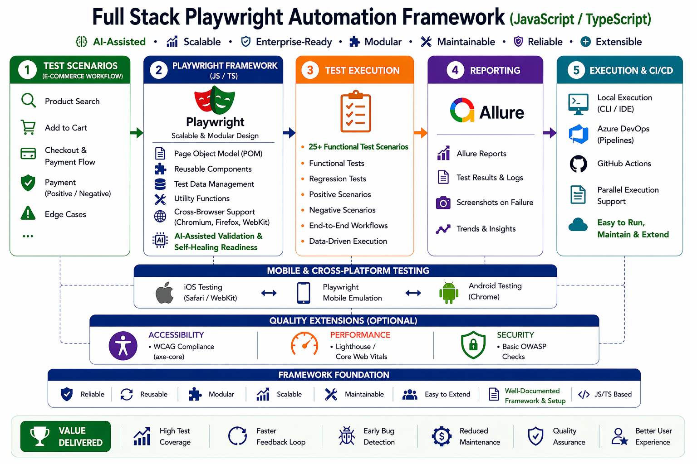
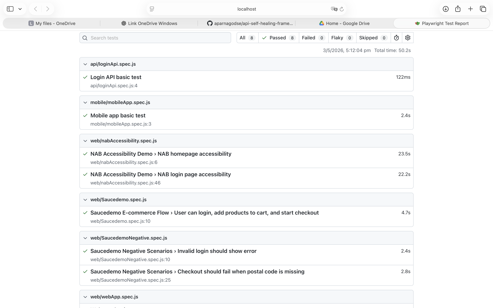
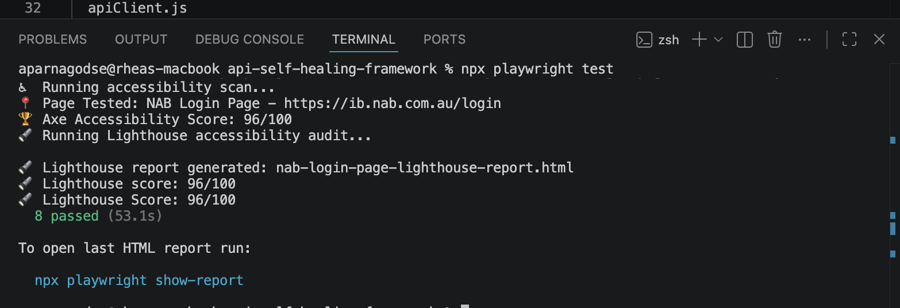
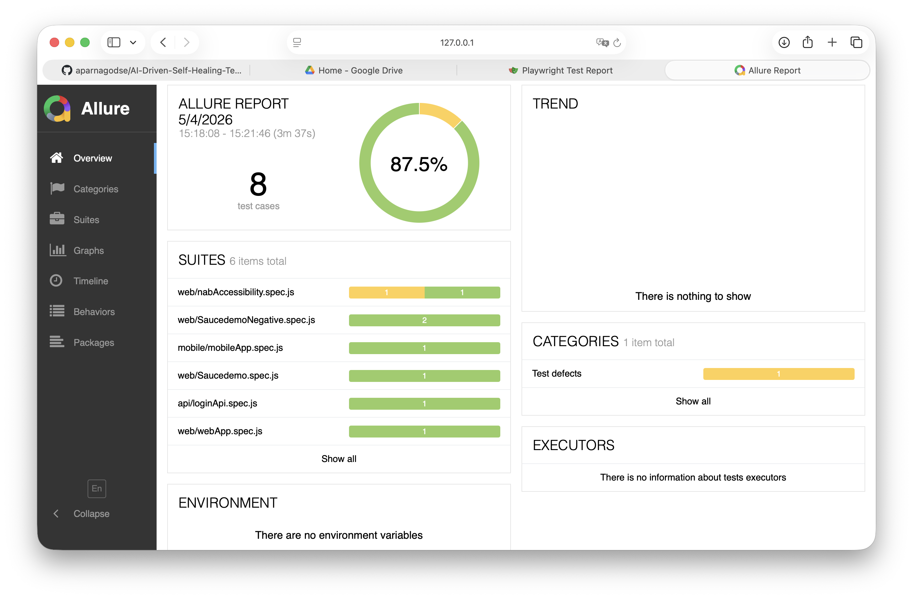
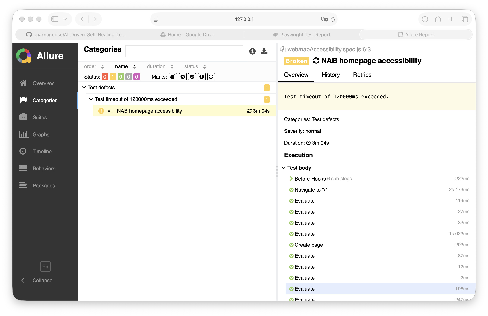

# 🤖 AI-Driven Self-Healing Playwright Testing Framework

An AI-driven Full Stack Test Automation Framework built using Playwright, covering API, Web UI, Accessibility, Performance, and Mobile testing with intelligent self-healing capabilities.

---

## 🚀 Key Features

- End-to-end automation using Playwright (API + UI)
- AI-assisted self-healing for flaky test recovery
- Reusable API client layer for scalable testing
- Page Object Model (POM) for maintainable UI tests
- Accessibility testing using axe-core
- Performance validation using Lighthouse
- Mobile testing structure for responsive scenarios
- CI/CD integration using GitHub Actions
- Allure reporting with AI insights

---

## 🧠 Framework Architecture

<p align="center">
  
</p>

---

## 📸 Demo Screenshots

### ✅ Playwright Test Report


---

### ⚡ Test Execution + Accessibility + Performance


---

## 📊 Allure Report

### Dashboard Overview


---

### Failure Analysis


---

## 🤖 AI Failure Analysis


---

## 🧩 Framework Structure

```text
core/
  apiClient.js
  aiHealer.js
  accessibility.js
  lighthouse.js
  performance.js

pages/
  BasePage.js
  LoginPage.js
  HomePage.js
  ProductPage.js
  CartPage.js
  CheckoutPage.js

tests/
  api/
  web/
  e2e/
  mobile/
  performance/

fixtures/
utils/
```

---

## ▶️ Demo Video

👉 https://drive.google.com/file/d/1A1DT-3QVswHYtVJ5rDmKKXfzw5PaI7M5/view

---

## ⚙️ How to Run

```bash
npm install
npx playwright install
npx playwright test
```

---

## 📊 Reporting

```bash
npx playwright show-report
npx allure generate allure-results --clean -o allure-report
npx allure open allure-report
```

---

## 💡 What Makes This Framework Different?

- AI-driven failure analysis with suggestions
- Self-healing automation approach
- Full-stack testing (API + UI + Accessibility + Performance)
- Enterprise-level reporting with Allure

---

## 👩‍💻 Author

Aparna Godse
